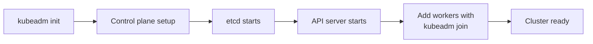

# Cluster Basics - kubeadm and Infrastructure

**Exam Weight:** 25% (Highest priority!)  
**Time Budget:** 30 minutes during exam

## Overview

This module covers cluster architecture, installation, and maintenance - one of the most heavily weighted domains in the CKA exam (25%!). You'll learn how clusters work, how to upgrade them, and how to recover from failures.

## Topics Covered

1. **Cluster Architecture** - Components and communication
2. **kubeadm Installation** - Setting up a cluster from scratch
3. **Cluster Upgrade** - Updating Kubernetes versions safely
4. **Backup and Recovery** - Protecting critical cluster data (etcd)
5. **High Availability** - Multi-master setups
6. **Certificate Management** - CSR and cert renewal

## 📚 Learning Path

### Quick Labs (Start Here - 15-20 mins each)
- [Lab 1: Cluster Exploration](#lab-1-explore-your-existing-cluster) - Get familiar with a cluster
- [Lab 2: kubeadm Components](#lab-2-understand-kubeadm) - Understand what's running

### Comprehensive Labs (30-60 mins each)
- [Lab 3: Cluster Upgrade](#lab-3-cluster-upgrade-scenario) - Upgrade Kubernetes safely
- [Lab 4: Backup etcd](#lab-4-backup-etcd) - Protect your cluster data
- [Lab 5: Node Management](#lab-5-node-maintenance) - Drain, upgrade, restore nodes

### Scenarios
- [Multi-Node Cluster Management](#scenario-manage-multi-node-cluster) - Real-world cluster ops

---

## ✅ Lab 1: Explore Your Existing Cluster

**Duration:** 15 minutes  
**Objective:** Understand cluster components and structure

### Step 1: Check Cluster Info

```bash
# See overall cluster status
kubectl cluster-info

# Expected output shows control plane location
# Kubernetes control plane is running at https://...
# CoreDNS is running at https://...
```

### Step 2: Examine Control Plane Components

```bash
# List all components
kubectl get componentstatus

# OR (older method)
kubectl get cs
```

Control plane has these critical components:
- **kube-apiserver** - REST API for all Kubernetes operations
- **kube-scheduler** - Assigns pods to nodes
- **kube-controller-manager** - Runs controller processes
- **etcd** - Distributed key-value store (all cluster data!)

### Step 3: Verify Node Status

```bash
# See nodes in your cluster
kubectl get nodes

# Get detailed node info
kubectl get nodes -o wide

# Describe a specific node
kubectl describe node <node-name>
```

### Step 4: Check System Pods

Control plane runs in system pods (in kube-system namespace):

```bash
# List all system pods
kubectl get pods -n kube-system

# You should see:
# - coredns-* (DNS service)
# - kube-apiserver-* (API server)
# - kube-controller-manager-* (controller manager)
# - kube-scheduler-* (scheduler)
# - etcd-* (database - CRITICAL!)
```

### Step 5: Verify CNI (Networking)

```bash
# Check what network plugin is installed
kubectl get daemonset -n kube-system

# For AKS, look for:
# - azure-cni (or konnectivity-agent)
# - kube-proxy (allows network routing)

# Check network policies support
kubectl get networkpolicies -A
```

### Verification

You should be able to:
- [ ] Identify all control plane components
- [ ] List nodes and their status
- [ ] Explain what each component does
- [ ] Verify networking is running

---

## ✅ Lab 2: Understand kubeadm

**Duration:** 20 minutes  
**Objective:** Know kubeadm workflow and commands

### Understanding kubeadm

`kubeadm` is the **official tool for bootstrapping Kubernetes clusters**. Exam focuses on:
- What it does
- How it initializes clusters  
- How to upgrade with it

### Step 1: Check if kubeadm is Installed

```bash
# Check kubeadm version
kubeadm version

# Expected: Shows kubeadm version matching your cluster
```

### Step 2: Understand kubeadm Commands

```bash
# See all kubeadm commands
kubeadm -h

# Key commands you'll see on exam:
# - kubeadm init           Initialize control plane
# - kubeadm join           Join worker node to cluster
# - kubeadm upgrade        Upgrade cluster components
# - kubeadm token          Manage join tokens
# - kubeadm reset          Tear down cluster
# - kubeadm certs          Manage certificates
```

### Step 3: View kubeadm Configuration

On a kubeadm-created cluster, config is stored:

```bash
# View cluster configuration
# (This may not exist on AKS - that's okay for this lab)
cat /etc/kubernetes/manifests/kube-apiserver.yaml 2>/dev/null || echo "Not found (AKS managed)"

# Check kubeadm status
kubeadm version
```

### Step 4: Understand Certificate Management

```bash
# Check certificate expiry (IMPORTANT!)
kubeadm certs check-expiration

# Expected output shows expiry dates for:
# - apiserver
# - apiserver-kubelet-client
# - controller-manager
# - scheduler
# - etc.
```

### Key kubeadm Workflow



### Verification

You should understand:
- [ ] What kubeadm does
- [ ] Main kubeadm commands
- [ ] How clusters are initialized
- [ ] Certificate lifecycle

---

## ✅ Lab 3: Cluster Upgrade Scenario

**Duration:** 30 minutes  
**Objective:** Practice safe cluster upgrade procedures

**This lab simulates upgrading a cluster. On AKS, upgrades are managed by Azure, but the process is similar.**

### Understanding Upgrade Process

Cluster upgrades follow this pattern:
1. **Plan** - Check current version, plan upgrade path
2. **Drain nodes** - Remove workloads gracefully
3. **Upgrade components** - Update in specific order
4. **Uncordon nodes** - Resume scheduling

### Step 1: Check Current Version

```bash
# Get control plane version
kubectl version --short

# Get node versions
kubectl get nodes

# All should show similar Kubernetes version (e.g., v1.28.0)
```

### Step 2: Plan Upgrade Path

```bash
# Check what versions are available
# (Command varies by cloud provider)
# For AKS:
az aks get-upgrades --resource-group <RG> --name <CLUSTER>
```

### Step 3: Drain a Node (Before Upgrade)

Before upgrading a node, drain its pods:

```bash
# Drain node - remove all pods gracefully
kubectl drain <node-name> --ignore-daemonsets

# What happens:
# 1. Cordons node (no new pods scheduled)
# 2. Evicts pods to other nodes
# 3. Waits for graceful termination

# Check node status
kubectl get nodes  # Should show NotReady or SchedulingDisabled
```

### Step 4: Simulate Node Upgrade

```bash
# On controlled system, you would manually upgrade kubelet/kubectl
# For AKS, Azure handles this
# Just verify node comes back:

# Uncordon node
kubectl uncordon <node-name>

# Verify node is ready
kubectl get nodes  # Should show Ready
```

### Step 5: Verify Cluster Health Post-Upgrade

```bash
# All nodes ready
kubectl get nodes

# All pods running
kubectl get pods -A

# Check control plane
kubectl get componentstatus
```

### Important Upgrade Notes

```
⚠️ Upgrade Order (MUST follow):
1. master/control plane components first
2. then worker nodes one at a time
3. Each node must fully upgrade before next

⚠️ Don't upgrade:
- Skip minor versions (1.26→1.28 needs 1.27 first)
- During production traffic (use PDB - Pod Disruption Budget)

✅ Best practices:
- Backup etcd before upgrading
- Test on non-prod cluster first
- Have rollback plan
- Drain with --ignore-daemonsets and --delete-local-data if needed
```

### Verification

- [ ] Can drain a node
- [ ] Understand upgrade order
- [ ] Can uncordon a node
- [ ] Verify cluster health after upgrade

---

## ✅ Lab 4: Backup etcd

**Duration:** 30 minutes  
**Objective:** Protect cluster data with etcd backup

**etcd stores ALL cluster data - losing it means losing the entire cluster state!**

### Understanding etcd

```
etcd = Distributed key-value store
Stores: All API objects, configuration, state
Risk: If lost, cluster is unusable
Solution: Regular backups!
```

### Step 1: Locate etcd

```bash
# etcd runs as a pod in kube-system
kubectl get pods -n kube-system | grep etcd

# Expected: etcd-<master-node-name>

# Get etcd details
kubectl describe pod etcd-<name> -n kube-system
```

### Step 2: Check etcd Configuration

```bash
# View etcd manifest (usually in /etc/kubernetes/manifests)
# For AKS: May not have direct access

# But you can see the etcd args:
kubectl get pod etcd-<name> -n kube-system -o yaml | grep -A5 "args:"

# Key args:
# --data-dir    Path to etcd data
# --listen-client-urls   Where clients connect
```

### Step 3: Take an etcd Snapshot Backup

```bash
# Get etcd endpoints and certificates (from etcd pod)
# For managed clusters like AKS, this may be limited

# On self-managed clusters, you would:
ETCDCTL_API=3 etcdctl \
  --endpoints=https://127.0.0.1:2379 \
  --cacert=/etc/kubernetes/pki/etcd/ca.crt \
  --cert=/etc/kubernetes/pki/etcd/server.crt \
  --key=/etc/kubernetes/pki/etcd/server.key \
  snapshot save /backup/etcd-backup.db

# Result: Binary snapshot file
```

### Step 4: Verify Backup

```bash
# Check that backup file exists and has size > 0
ls -lh /backup/etcd-backup.db

# Verify backup integrity (from within cluster)
ETCDCTL_API=3 etcdctl \
  --endpoints=https://127.0.0.1:2379 \
  --cacert=/etc/kubernetes/pki/etcd/ca.crt \
  --cert=/etc/kubernetes/pki/etcd/server.crt \
  --key=/etc/kubernetes/pki/etcd/server.key \
  snapshot status /backup/etcd-backup.db
```

### Step 5: Restore from Backup (Emergency Only!)

```bash
# This is disaster recovery - use ONLY if etcd is lost

ETCDCTL_API=3 etcdctl \
  snapshot restore /backup/etcd-backup.db \
  --data-dir=/var/lib/etcd-restored

# Then restart etcd to use new data-dir
# This would restore cluster to backup point
```

### Backup Best Practices

```yaml
✅ DO:
- Take regular snapshots (daily/weekly)
- Store backups off-cluster
- Test restore procedure periodically
- Automate backup process
- Document recovery steps

❌ DON'T:
- Store backups on same machine as etcd
- Assume backup works without testing restore
- Skip backup for "test" clusters (they matter too!)
```

### Verification

- [ ] Know where etcd data is stored
- [ ] Can take snapshot backup  
- [ ] Understand restore process
- [ ] Know backup automation tools

---

## 📝 Troubleshooting Quick Reference

### Issue: Control plane pod not starting
```bash
# Check pod logs
kubectl logs <pod-name> -n kube-system -c <container>

# Check pod events
kubectl describe pod <pod-name> -n kube-system
```

### Issue: Node not ready after upgrade
```bash
# Check kubelet logs
journalctl -u kubelet -n 50

# Check node status
kubectl describe node <node-name>
```

### Issue: Can't drain node
```bash
# Force drain with warnings
kubectl drain <node> --ignore-daemonsets --delete-emptydir-data

# Check for pods without PDB
kubectl get pods -A --field-selector=spec.nodeName=<node>
```

---

## 🎓 Key Concepts for Exam

| Concept | What to Know |
|---------|-------------|
| kubeadm | Bootstrapping tool for K8s clusters |
| Control Plane | API server, scheduler, controller-manager, etcd |
| etcd | ALL cluster data stored here - backup it! |
| Upgrade | Must drain nodes, upgrade in order, verify |
| Drain | Remove pods gracefully before maintenance |
| Cordon | Stop new pods scheduling on node |
| Uncordon | Resume scheduling after maintenance |

---

## 💪 Ready to Move On?

After this module, you should be able to:
- [ ] Explain Kubernetes cluster architecture
- [ ] Use kubeadm commands
- [ ] Perform safe node upgrades with drain/uncordon
- [ ] Back up and restore etcd
- [ ] Troubleshoot control plane issues

**Confidence Check:** If you can do all above, move to Workloads module  
**Still struggling?** Revisit and repeat labs!

---

**Next:** [Workloads Module](../workloads/README.md)  
**Track Progress:** [PROGRESS_TRACKER.md](../PROGRESS_TRACKER.md)
